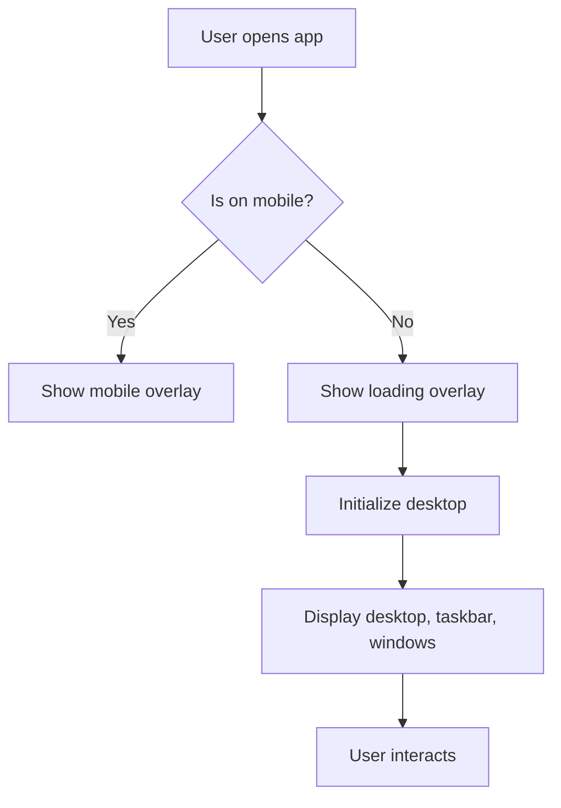
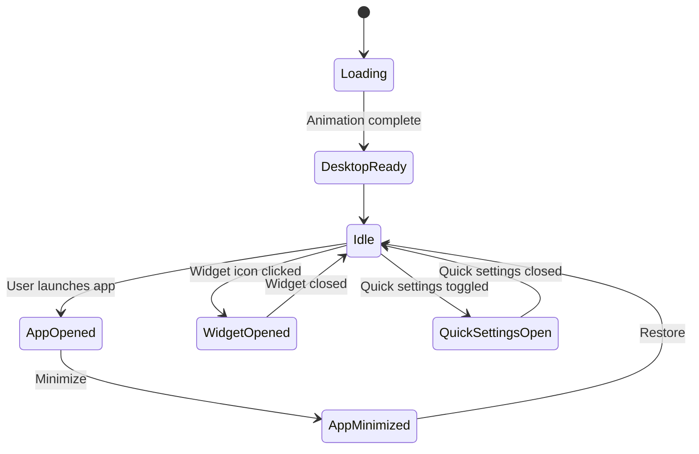

# 📦 Web-Based OS Documentation

Welcome to the documentation for the **Web-Based OS** project! This project simulates a modern desktop operating system within your browser. It provides a desktop environment, taskbar, start menu, windowed applications, widgets, and more, closely emulating the look and feel of Windows/macOS.

Below you'll find in-depth details and explanations for each code file: `index.html`, `style.css`, and `os.js`.

---

## `index.html` – Main Application Shell

This HTML file acts as the structure and entry point for the Web-Based OS. It defines all major UI containers, overlays, and core desktop zones. The file is tightly coupled with `style.css` for appearance and `os.js` for dynamic functionality.

### Main Sections

- **Screen Brightness Overlay:** For simulating software-based screen dimming.
- **Loading Overlay:** Displays a boot-like animation and progress bar.
- **Mobile Overlay:** Shows a notice if the user opens the OS on a mobile device.
- **Desktop (`#desktop`):** The main workspace for icons and windows.
- **Taskbar (`#taskbar`):** Windows/macOS style bar at the bottom for running apps, Start menu, widgets, and system status.
- **Start Menu & Context Menu:** Hidden until triggered.
- **Quick Settings Panel:** A slide-out for toggles and sliders (brightness, volume, etc).
- **Windows:** Windows for App Store, Weather, Stocks, Spotify, etc.

### Key Elements

| Element ID               | Purpose                                                                    |
|--------------------------|----------------------------------------------------------------------------|
| `#screen-brightness-overlay` | Simulate brightness adjustments.                                  |
| `#loading-overlay`       | Initial boot animation and progress.                                       |
| `#desktop`               | Background area where icons and windows reside.                            |
| `#my-computer-icon`      | Default desktop icon, draggable.                                           |
| `#taskbar`               | Main horizontal bar: widgets, running apps, center (start/search), system tray. |
| `#start-menu`            | Popup Start Menu, hidden by default.                                       |
| `#start-menu-window`     | Richer, windowed version of Start Menu.                                    |
| `#context-menu`          | Right-click menu for desktop/folders.                                      |
| `#calendar-popup`        | Calendar popup, shown when clicking the clock.                             |
| `#widgets-panel`         | Slide-out panel with system widgets.                                       |
| `#weather-side-window`   | Weather widget side window.                                                |
| `#stocks-side-window`    | Customizable theme/wallpaper widget side window.                           |
| `#spotify-player-window` | Spotify widget/player.                                                     |
| `#quick-settings-panel`  | Quick toggles for system settings.                                         |

### Notable UI Features

- **SVG Icons:** Most graphical elements are vector SVGs for crisp visuals.
- **Desktop Experience Only:** Mobile users see a friendly overlay and are instructed to use a desktop.
- **App Store Window:** macOS-style, draggable, resizable, and with sidebar navigation.
- **Storage View:** Simulated drives with usage bars and upgrade CTA.
- **Taskbar:** Centered Start, search input, system tray, connection status, quick settings, and taskbar icons for active/minimized apps.

### Example: Desktop Markup

```html
<div id="desktop">
  <div id="my-computer-icon" class="desktop-icon" draggable="true">
    <div class="icon-image">
      <!-- SVG icon here -->
    </div>
    <div class="icon-label">My Computer</div>
  </div>
</div>
```

### App Store Window Example

```html
<div id="app-store-window" class="app-window" style="display: none;">
  <div class="window-header">
    <div class="traffic-lights">
      <div class="light red" id="app-window-close"></div>
      <div class="light yellow" id="app-window-minimize"></div>
      <div class="light green" id="app-window-maximize"></div>
    </div>
  </div>
  <div class="window-body">
    <div class="sidebar">
      <!-- Sidebar with search, categories, etc. -->
    </div>
    <div class="main-content">
      <!-- Main content such as storage, files, etc. -->
    </div>
  </div>
  <div class="resize-handle-se"></div>
</div>
```

### Process Flow: Application Boot



---

## `style.css` – UI Styling & Theming

This file provides the look and feel of the OS environment using modern CSS techniques.

### Styling Highlights

- **Font-Faces:** Uses "SF Pro Display" for a modern, Apple-like feel.
- **Colors & Variables:** CSS custom properties (`:root`) manage theme colors for backgrounds, accents, and UI surfaces.
- **Responsive UI:** Ensures key overlays behave well on desktop and mobile screens.
- **Glassmorphism:** Taskbar, windows, and quick settings use transparency and blur effects.

### Key UI Areas

| CSS Selector                | UI Area / Purpose                              |
|-----------------------------|-----------------------------------------------|
| `#screen-brightness-overlay`| Fullscreen overlay for brightness simulation. |
| `#desktop`                  | Main desktop background.                      |
| `.desktop-icon`             | Icon size, padding, drag state.               |
| `#taskbar`                  | Sticky bottom bar, glass effect.              |
| `#start-menu`, `#start-menu-window` | Popup and windowed Start menu.    |
| `#context-menu`             | Right-click menu.                             |
| `#loading-overlay`          | Boot animation overlay.                       |
| `#widgets-panel`            | Widget panel slide-out.                       |
| `.app-window`               | Generic window styling (App Store, etc).      |
| `.traffic-lights`           | macOS window control icons.                   |
| `.resize-handle-se`         | Resizable window handle.                      |
| `#mobile-overlay`           | Fullscreen overlay for mobile users.          |
| `.quick-settings-*`         | Tiles, sliders, actions for quick settings.   |

### Example: Taskbar Styling

```css
#taskbar {
    display: flex;
    align-items: center;
    justify-content: space-between;
    position: fixed;
    left: 50%;
    transform: translateX(-50%);
    bottom: 10px;
    width: 96vw;
    height: 50px;
    background: linear-gradient(135deg, rgba(255, 255, 255, 0.10) 0%, rgb(60 60 60 / 10%) 100%);
    color: var(--taskbar-fg);
    z-index: 1000;
    /* ... */
}
```

### Example: App Window (macOS Style)

```css
.app-window {
    position: absolute;
    width: 80vw;
    max-width: 1000px;
    background-color: rgba(40, 40, 40, 0.75);
    border-radius: 12px;
    box-shadow: 0 25px 50px -12px rgba(0, 0, 0, 0.5);
    border: 1px solid rgba(255, 255, 255, 0.1);
    backdrop-filter: blur(20px) saturate(180%);
    display: flex;
    flex-direction: column;
    /* ... */
}
```

### Feature Table

| Feature                                   | Provided By        |
|--------------------------------------------|--------------------|
| Modern fonts and fallback                  | `@font-face`       |
| Drag-and-drop icon support                 | `.desktop-icon`    |
| Taskbar app indicators                     | `.taskbar-app-icon`|
| Animated loading screen                    | `#loading-overlay` |
| Resizable, draggable windows               | `.app-window`      |
| Quick settings sliders (brightness, etc.)  | `.quick-settings-*`|
| Widgets and side-windows                   | `#widgets-panel`, `#weather-side-window`, etc. |
| Mobile overlay for unsupported devices     | `#mobile-overlay`  |

### Example: Mobile Overlay

```css
#mobile-overlay {
    position: fixed;
    top: 0; left: 0;
    width: 100%; height: 100%;
    background: linear-gradient(135deg, #1e1e1e 0%, #2d2d2d 100%);
    z-index: 9999;
    display: flex;
    align-items: center;
    justify-content: center;
    /* ... */
}
```

---

## `os.js` – Operating System Logic

The main JavaScript file implements the desktop environment's logic, including window management, widgets, apps, storage simulation, and UI behaviors.

### Major Functional Areas

- **Desktop Boot/Loading:** Handles animated loading screen and session logic.
- **Desktop Icons:** Draggable, persistent (via `localStorage`), double-click to open apps/folders.
- **Window System:** App windows (App Store, Notepad, Spotify, Camera, etc.) can be moved, resized, minimized, maximized, and closed. Each window is managed by a `windowManager`.
- **Taskbar:** Shows running/minimized windows as icons. Clicking restores/minimizes associated windows.
- **Start Menu:** Rich, dynamic start menu with pinned apps, recommended items, user info, and settings.
- **Right-Click Context Menu:** For desktop and folder icons, supports refresh, new, delete, and rename actions.
- **Widgets:** Weather, Spotify, Stocks (wallpaper/theme), and News widgets, each with animated side panels.
- **Quick Settings:** Panel for toggles (art, bluetooth, flight mode, etc.), sliders (brightness, volume), and connection status.
- **Calendar Popup:** Shows an interactive monthly calendar on clicking the clock.
- **Mobile Detection:** Overlay disables all desktop features on mobile devices.
- **Simulated Storage:** Fake storage with named "drives", progress bars, and upgrade button.
- **Apps:** Notepad, Camera, Chrome (Bing search), Image Viewer, etc., each windowed and feature-rich.
- **Persistent State:** Positions and settings are saved via `localStorage` for icons, folders, and brightness.
- **Spotify API** (optional): Integration for track search and playback (requires developer credentials).

### Component Interaction

```mermaid
flowchart LR
    subgraph Desktop
        DesktopIcons
        Windows
        ContextMenu
        Widgets
        QuickSettings
        Taskbar
        StartMenu
    end
    DesktopIcons --> Windows
    StartMenu -- Launch app --> Windows
    Taskbar -- Click icon --> Windows
    Widgets -- Open/close --> Windows
    Windows -- Minimize/restore --> Taskbar
    ContextMenu -- Actions --> DesktopIcons
    QuickSettings -- Toggles/Sliders --> Desktop, Overlay
```

### Key Functions & Classes

| Function/Class                 | Purpose                                                      |
|------------------------------- |-------------------------------------------------------------|
| `updateClock`                  | Real-time taskbar clock.                                     |
| `updateConnectionStatus`       | Online/offline detection and notification.                   |
| `renderStartMenu`              | Generates dynamic Start menu window.                         |
| `toggleStartMenuWindow`        | Opens/closes Start menu.                                     |
| `renderCalendar`               | Builds monthly calendar popup.                              |
| `toggleCalendar`               | Shows/hides calendar window.                                |
| `renderWidgetsPanel`           | Generates widgets panel UI.                                  |
| `toggleWidgetsPanel`           | Opens/closes widgets slide-out.                              |
| `windowManager` (object)       | Central registry for app windows (z-index, state, etc).      |
| `minimizeWindow`, `restoreWindow` | Minimize/restore logic for windows.                     |
| `openAppStoreWindow`, `closeAppStoreWindow` | Show/hide App Store window.                |
| `createTaskbarIcon`            | Adds/removes icons to the taskbar for running apps.          |
| `getTaskbarIconSVG`            | Returns SVG markup for each taskbar app icon.                |
| `createNewFolderOnDesktop`     | Adds a new folder icon (persistent).                         |
| `renderFolder`                 | Places a folder icon at given position.                      |
| `createFolderWindow`           | Simulates a folder's window UI.                              |
| `createChromeSearchWindow`     | Opens a Chrome-like search window with Bing integration.      |
| `createNotepadWindow`          | Opens a notepad window with font and color controls.          |
| `createCameraWindow`           | Opens a camera app, saves photos to User Cloud/Pictures.      |
| `createImageViewerWindow`      | Opens an image viewer with zoom/rotate controls.              |
| `renderAppStoreFolderContents` | Simulated file system for App Store storage.                  |
| `attach*Handler`               | Utility for binding event handlers to dynamic elements.       |

### Example: Taskbar App Window Management

```js
function minimizeWindow(id) {
  const windowState = windowManager.get(id);
  if (!windowState || windowState.isMinimized) return;
  // Animate and hide window, add taskbar icon
}
function restoreWindow(id) {
  const windowState = windowManager.get(id);
  if (!windowState || !windowState.isMinimized) return;
  // Restore window, remove taskbar icon
}
```

### Example: Weather Widget with Geolocation

```js
function toggleWeatherWindow() {
  if (weatherSideWindow.classList.contains('open')) {
    weatherSideWindow.classList.remove('open');
  } else {
    // Show loading
    // Use geolocation and Open-Meteo API to fetch temperature/weather
    // Render weather info in side window
  }
}
```

### Example: Creating a New Folder

```js
function createNewFolderOnDesktop() {
  const left = '120px';
  const top = '20px';
  const name = getUniqueFolderName();
  // Save to localStorage and render on desktop
}
```

### Example: Simulated File System Navigation

```js
const appStoreFileSystem = {
  "Applications": { /* ... */ },
  "User Cloud": { 
    "Pratik Personal": { "Documents": {}, "Pictures": {} },
    "Music": {}, "Videos": {}
  }
};
let appStoreCurrentPath = [];
function renderAppStoreFolderContents() {
  // Traverse appStoreCurrentPath to get current folder
  // Render subfolders/files
}
```

### Example: Bing Search Integration (Chrome App Window)

```js
function createChromeSearchWindow() {
  // Creates window with input box and iframe for Bing results
  function performBingSearch(query) {
    const searchUrl = `https://www.bing.com/search?q=${encodeURIComponent(query)}`;
    resultsContainer.innerHTML = `<iframe src="${searchUrl}" ...>`;
  }
  // Bind search button and Enter key
}
```

---

### State Management & Event Flow



---

## Widgets & Apps Overview

| App/Widget      | How to Open             | Features                                                         |
|-----------------|------------------------|------------------------------------------------------------------|
| Notepad         | Start Menu → Notepad   | Font size, bold, italic, color, draggable, resizable.            |
| Camera          | Start Menu → Camera    | Live webcam, take photo, auto-save to “User Cloud/Pictures”.     |
| Chrome Search   | Start Menu → Chrome    | Bing search in window, results via iframe.                       |
| Weather         | Widgets panel → Weather| Uses geolocation and Open-Meteo API, displays current weather.   |
| Spotify         | Widgets panel → Spotify| (If configured) Play/search tracks with Spotify API.             |
| Stocks/Theme    | Widgets panel → Stocks | Switch wallpaper from gallery.                                   |
| Folders         | Right-click → New      | Persistent, draggable, renamable desktop folders.                |
| App Store       | Double-click My Computer| Browse fake storage, installed apps, user cloud.                 |

---

## Data Flow: Creating & Managing Desktop Folders

```mermaid
flowchart TD
    A[User right-clicks desktop] --> B["Select 'New'"]
    B --> C[createNewFolderOnDesktop()]
    C --> D[Save folder details to localStorage]
    D --> E[renderFolder()]
    E --> F[Icon appears on desktop]
    F -- Drag/Drop --> G[Update position and save to localStorage]
    F -- Rename/Delete --> H[Update or remove entry from localStorage]
```

---

## Appearance and Usability Notes

- 🖥️ **Desktop-Only**: The interface blocks mobile users, ensuring full experience only on desktops/laptops.
- 🎨 **Theming**: Many widgets and UI panels use gradients, custom icons, and glassmorphism.
- 🪟 **Windows**: All major apps use windowed interfaces with macOS-style controls.
- ⚡ **Performance**: UI elements are optimized for quick interaction and smooth drag/resize effects.
- 🌐 **Integration**: Weather and Spotify widgets integrate with real-world APIs (with configuration).

---

## How to Add Your Own Apps

To extend the OS with new apps:

1. Add a new start menu app in `renderStartMenu`.
2. Define a function to create the app window and its UI.
3. Use `windowManager.register` to manage its z-index and state.
4. Optionally, define taskbar icon SVG in `getTaskbarIconSVG`.
5. Hook up any necessary event handlers for launching from Start or desktop.

---

## Security & API Notes

- **Spotify Integration**: Requires developer credentials. The current code expects you to replace `YOUR_SPOTIFY_CLIENT_ID` and `YOUR_SPOTIFY_CLIENT_SECRET`.
- **Weather**: Uses Open-Meteo, which doesn't need an API key.
- **Search**: Bing search is loaded in an iframe for simplicity.

---

## No HTTP API Endpoints

This project is entirely client-side and does not define any REST API endpoints or HTTP routes in the code. All app-like behaviors are simulated locally.

---

## Final Remarks

This Web-Based OS is a modern, extensible desktop simulation for the web. It demonstrates:

- Advanced UI/UX with HTML/CSS/JS.
- Window management, persistent state, and simulated file systems.
- Integration with public APIs for weather and (optionally) music.
- Realistic, touch-friendly interactions and accessibility for desktop users.

**Enjoy exploring and customizing your own web desktop!** 🚀

---

## Structure Overview (Quick Reference)

This short overview lists the main sections for quick navigation. It helps readers find topics faster.

- `index.html`: Main containers, overlays, taskbar, start menu, and windows.
- `style.css`: Visual styles, glass effects, widgets, quick settings, and windows.
- `os.js`: Logic for windows, widgets, start menu, storage, and persistence.
- Widgets & Apps Overview: How to open and what each provides.
- Data Flow and State: Folder flow and lifecycle states.
- Extensibility, Security, and Final Remarks.

## How to Edit This Project

You can edit this project with any modern editor. No build tooling is required.

- Download or clone the project.
- Open `index.html` in a browser to run it.
- Use a local server for best results with assets.

```bash
# Simple local server options
# Python 3
python -m http.server 8080

# Node (http-server, if installed)
npx http-server -p 8080
```

- Edit UI structure in `index.html`.
- Change styles and themes in `style.css`.
- Modify logic and apps in `os.js`.

### Common Customizations

- Replace the desktop wallpaper in CSS or via the Stocks widget.
- Adjust Start Menu apps inside `renderStartMenu()` in `os.js`.
- Tweak quick settings tiles inside the `#quick-settings-panel` markup.
- Update widget icons or order in `renderWidgetsPanel()`.

### Spotify Setup (Optional)

Set your credentials in `os.js` to enable Spotify search.

```js
const SPOTIFY_CLIENT_ID = 'YOUR_CLIENT_ID';
const SPOTIFY_CLIENT_SECRET = 'YOUR_CLIENT_SECRET';
```

### Add a New App

- Create a window function similar to `createNotepadWindow()`.
- Register it with `windowManager.register(id, el)`.
- Add a launcher in `renderStartMenu()` or as a desktop icon.
- Add a taskbar icon mapping in `getTaskbarIconSVG()` if needed.

### Persistence Tips

- Desktop brightness stores under `desktopBrightness`.
- Icon positions store under keys like `my-computer-icon-position`.
- Folders persist under `desktopFolders`.

### Contributing Changes

- Fork the repository and create a new branch.
- Make edits and test locally.
- Submit a pull request with a clear summary.